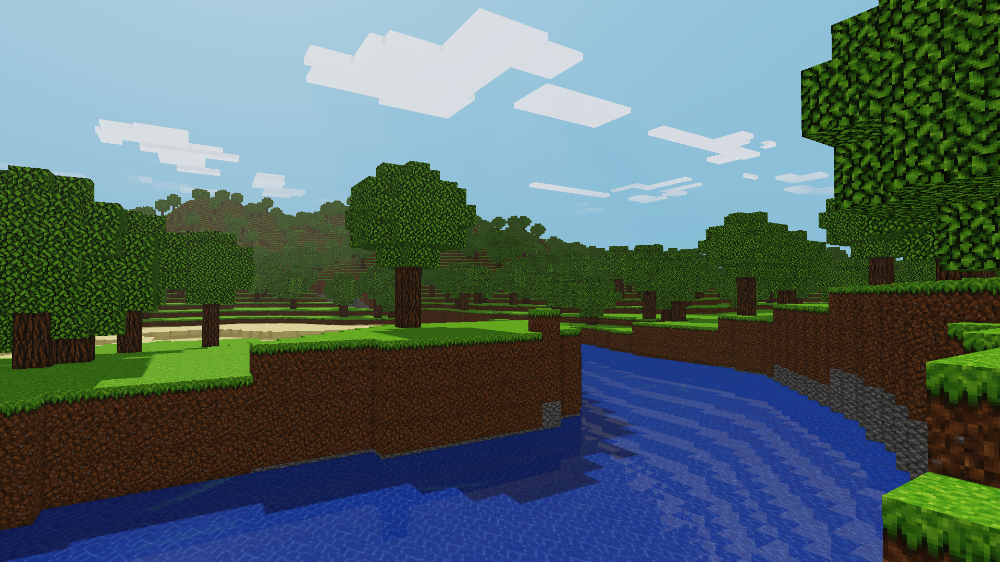
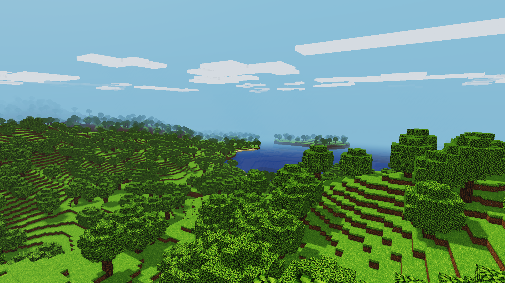
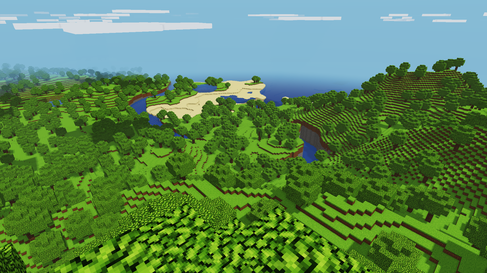
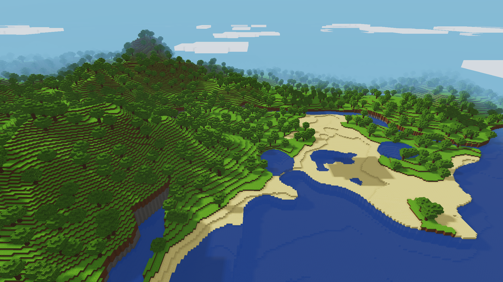

# VulkanCraft

VulkanCraft is a compact voxel sandbox written in C++23. The first playable
vertical slice generates a deterministic procedural world, removes hidden voxel
faces, renders it through Vulkan 1.3, and lights it with a moving directional sun
and four cascaded shadow maps.

Current version: **1.6.1**.

This is an original learning project. It does not contain Minecraft source code,
branding, or game assets.

## Showcase

| River valley | Forest horizon |
| --- | --- |
|  |  |

| Coastal landscape | Mountain lagoon |
| --- | --- |
|  |  |

## Features

- Deterministic, asynchronously streamed terrain with continents, mountains,
  lowland rivers, oceans, lakes, ravines, caves, grass, dirt, sand, stone, logs,
  leaves, water, and air.
- Native 32 by 32 fixed-orientation face mapping from a compact 4 by 3 atlas.
  Grass, dirt, bark, log ends, bright leaves, sand, stone, and water use their
  dedicated cells. The current RGB spritesheet has fully opaque leaves.
  Water uses a slowly moving, integer-aligned blue-tile phase and symmetrically blends
  its edge texels to hide repetitive cell borders without scaling the sprite or
  sampling another atlas cell. A restrained base tint softens the repeated
  high-contrast pattern while retaining the first blue cell as the only water texture.
  Water color remains saturated after HDR tone mapping, uses 0.94 surface
  opacity, receives distance and underwater fog, and fades its SSR and depth tint
  with fog so the seabed does not dominate deep-water views. Subtle deterministic
  wave normals, angle-correct Fresnel, bounded hit confidence, and roughness filtering
  prevent the reflection from behaving like a flat mirror.
  Six sprite-local mip levels reduce distant aliasing without ever filtering
  across atlas-cell boundaries.
- Scheduled water simulation matches the Java Edition timing and reach used by
  the MVP: one update every five 20 Hz game ticks, unlimited one-block-at-a-time
  downward flow, and seven horizontal blocks beyond a source. Falling water
  resets its horizontal reach after reaching a floor, and nearby downward paths
  within four blocks receive priority.
- Collision-based first-person movement, jumping, crouching, sprinting, swimming,
  and mouse-driven block breaking and placement.
- Translucent water and varied rectangular voxel clouds, with a square sun, moon,
  and day-night cycle. Two-block-high clouds cast shadows without receiving them,
  become gray at night, and use a double-sided nearest-surface depth pass after
  opaque color and before water. Greedy cloud meshing emits only the external boundary shell, removes
  per-block grid seams, and keeps that shell visible from inside. Deterministic
  per-group wind speeds produce slow natural motion without desynchronizing their
  shadows. Four subtly separated wind layers prevent moving clouds and shadow
  casters from becoming coplanar and producing Z-fighting. Cloud formations use
  a three-times-larger deterministic horizontal shape scale. Stable 3 by 3 PCF
  keeps terrain, foliage, and cloud shadows crisp without the previous variable
  blur artifacts.
- A centered vertical celestial orbit with camera-independent, world-oriented sun
  and moon quads. Daylight and nighttime each last twelve real-time minutes, and
  celestial bodies are hidden while the camera is underwater.
- Indexed per-chunk opaque and transparent geometry, preceded by an alpha-tested
  Z pre-pass. Vertices use a compact 24-byte position/UV/packed-material layout;
  display colors and floating-point normals were removed. Visible chunks are
  submitted through persistent Vulkan multi-draw indirect command buffers.
- Six-plane camera-frustum culling rejects complete chunk AABBs before recording
  opaque, water, cloud, and Z pre-pass draws. Equivalent conservative frusta
  limit shadow casters independently for every cascade.
- Pure F3 wireframe rendering for opaque blocks, water, and clouds, with filled
  world-material passes disabled while the mode is active.
- Vulkan 1.3 dynamic rendering and synchronization2.
- Dynamic directional lighting with four stabilized 2048 by 2048 shadow cascades.
  Shadows end at 320 blocks, before atmospheric fog hides the transition, and
  distant stabilized cascades update every 2, 4, and 8 frames while the contact
  cascade updates every frame.
- An HDR post-processing foundation with restrained depth-reconstructed eight-direction SSAO that fades out with atmospheric fog,
  local bloom, six-sample CSM-aware volumetric sunlight, ten-step occlusion-aware
  god rays, and bounded medium-range view-space water reflections with valid-hit
  confidence and a short roughness filter, followed by
  tone mapping and gamma correction. World materials use a compact
  roughness/Fresnel PBR approximation and sprite-local luminance relief for
  texture-scale self-shadowing.
- A Voxy/Distant-Horizons-inspired terrain path: 16-cubed occupancy sections skip
  empty vertical ranges, the inner 17 by 17 chunks retain full voxel topology,
  and the outer horizon uses a deterministic surface heightfield LOD while
  preserving native 16 by 16 face mapping. Surface LOD keeps opaque seabeds
  separate from translucent water and seals its inner skirts, preventing caves
  and oceans from exposing the unrendered underside. Four persistent workers generate only
  newly entering strips and retain overlapping voxel columns and chunk meshes.
  Entering chunks and retained chunks that cross an LOD boundary share one
  packed upload, avoiding dozens of synchronous per-chunk transfers.
- Windows GLFW window and input layer.
- A responsive native loading screen while the first world is generated, a
  maximized 1280 by 720 starting window, F11 borderless monitor mode, and an
  in-frame cheat console with `/time set day` and `/time set night`.
- CMake FetchContent dependencies, strict warnings, and precompiled headers.
- Dependency-free automated tests for generation, bounds, determinism, water
  scheduling, meshing, LOD closure, and cascade calculations.

## Requirements

- Visual Studio 2026 with the Desktop development with C++ workload.
- CMake 3.25 or newer.
- The Vulkan SDK with `glslc`, and a Vulkan 1.3-capable driver.
- Git, used by CMake to fetch GLFW 3.4 and GLM 1.0.3.

## Build

```powershell
cmake --preset windows-debug
cmake --build --preset windows-debug
ctest --preset windows-debug
./build/windows-debug/bin/Debug/vulkancraft.exe
```

For normal play on the target hardware, use the optimized configuration:

```powershell
cmake --preset windows-release
cmake --build --preset windows-release
ctest --preset windows-release
./build/windows-release/bin/Release/vulkancraft.exe
```

To validate Vulkan initialization and render submission in a non-interactive
environment, run the hidden three-frame smoke test:

```powershell
./build/windows-debug/bin/Debug/vulkancraft.exe --smoke-test
```

The equivalent `--wireframe-smoke-test` option starts with the F3 rendering
pipeline selected, which is useful in automated graphics validation.
`--streaming-smoke-test` crosses twelve consecutive chunk boundaries and verifies that only
entering chunk batches are uploaded while overlapping GPU batches are retained.
`--edit-smoke-test` rebuilds an edited chunk and uploads the result, while
`--night-smoke-test` validates moon-driven lighting and cascaded shadows.
`--visual-smoke-test` stages a low-sun view above nearby water and keeps the
visible validation run open for 10,000 frames so water, SSR, god rays, and
volumetric lighting can be inspected. `--console-smoke-test` opens the visible
in-frame console with a representative command for UI inspection. `--benchmark`
renders 600 hidden frames and
prints the measured frame rate; it is the reproducible performance gate used by
the project rather than an estimated FPS value.

## Controls

| Input | Action |
| --- | --- |
| `W`, `A`, `S`, `D` | Move horizontally |
| `Space` | Jump, or swim upward while submerged |
| Double-tap `Space` | Toggle flight mode |
| Mouse | Look around |
| Left mouse button | Break the targeted block |
| Right mouse button | Place a dirt block |
| `Left Ctrl` | Crouch |
| `Space`, `Left Ctrl` while flying | Ascend or descend |
| `Left Shift` | Sprint |
| `F3` | Toggle pure block, water, and cloud wireframe rendering |
| `F11` | Toggle monitor-sized borderless mode |
| `'` | Open or close the cheat console |
| `/time set day` | Set the console-controlled clock to midday |
| `/time set night` | Set the console-controlled clock to midnight |
| `Escape` | Exit |

## Project layout

- `include/vulkancraft`: Public and internal C++ interfaces.
- `src`: Application, world, camera, and Vulkan implementation.
- `shaders`: GLSL source compiled to SPIR-V during the build.
- `tests`: Fast headless tests that do not require a Vulkan device.
- `docs/ARCHITECTURE.md`: Design, rendering flow, and extension points.
- `assets`: Runtime art. Block materials sample the supplied sprite sheet with
  nearest-neighbor filtering.

## Chunk configuration

Every chunk is 32 by 32 blocks. The vertical range is 384 blocks, from Y -64
through Y 319; Y 320 is the exclusive upper boundary. The default initial view
retains an exact 32 by 32 (1024-chunk) window, with an 832-block camera far plane. Terrain begins
matching the directional sky gradient at 300 blocks and becomes fully atmospheric
by 420 blocks, before the nearest guaranteed window edge. CPU generation
and meshing use four worker threads,
and the previous window remains playable until its replacement is ready. The
four persistent workers copy overlapping columns, generate only new padded edge
strips, and mesh only entering or LOD-transition chunks. The inner radius of eight chunks uses full
voxel meshes; all remaining chunks use compact surface-only generation and a continuous heightfield horizon
LOD while preserving deterministic ravines, water, tree trunks, foliage, and clouds. Retired dense voxel storage, outgoing chunk meshes, and uploaded CPU staging batches are released by the background rebuild instead of the render thread, and the worker pool runs below the render thread's CPU priority. The worker precombines the entering edge and retained LOD transitions, which are installed through
one packed GPU buffer while other overlapping chunks remain resident. Local block edits remesh
and replace only affected GPU chunk batches instead of uploading the complete
window.

The default profile deliberately favors bounded memory and low draw-call overhead
for a six-core i5-9400F, 8 GB of system memory, and a GTX 1660 with 6 GB of VRAM.

## License

VulkanCraft is available under the MIT License. See `LICENSE`.
